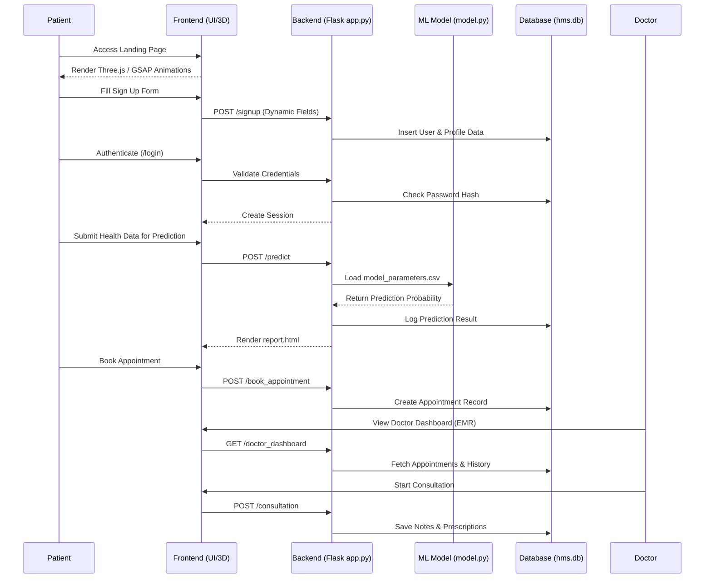
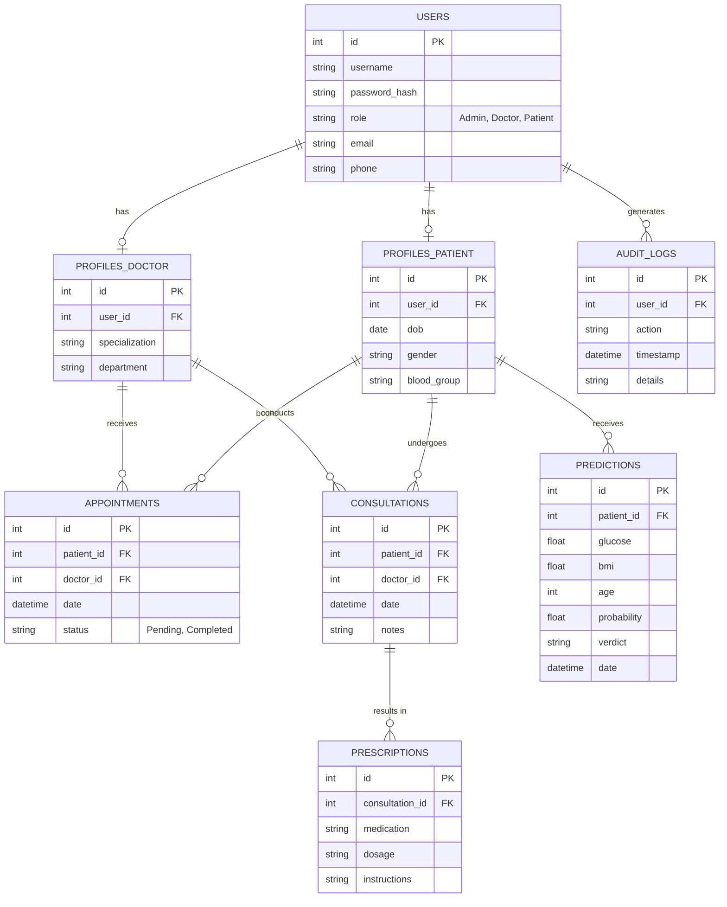

# DiabPredict AI: Advanced Hospital Management & Medical Intelligence Platform

DiabPredict AI is a comprehensive, production-ready Hospital Management System (HMS) that seamlessly integrates an enterprise Electronic Medical Record (EMR) system with a custom-trained Logistic Regression Artificial Intelligence for diabetes prediction.

It features a cinematic, award-winning 3D frontend interface, multiple user roles (Admin, Doctor, Patient), secure authentication, and a fully relational SQLite database.

---

## 🏗 Project Structure

The project is structured as a modular Flask application with separated frontend and backend logic.

```text
d:\dia_project_mlds\
│
├── app.py                     # Main Flask application, routing, and database logic
├── model.py                   # Machine learning script (Logistic Regression training)
├── diabetes.csv               # Pima Indians Diabetes Database (Training Data)
├── model_parameters.csv       # Trained ML weights and bias (Generated by model.py)
├── hms.db                     # Enterprise SQLite Relational Database (Auto-generated)
├── history.db                 # Legacy database maintained for backward compatibility
├── requirements.txt           # Python dependencies
├── README.md                  # This documentation
│
├── static/                    # Client-side assets
│   ├── style.css              # Custom Tailwind configurations, glassmorphism, and animations
│   └── script.js              # Three.js 3D logic and GSAP ScrollTrigger animations
│
└── templates/                 # Jinja2 HTML Templates
    ├── index.html             # Cinematic 3D landing page
    ├── login.html             # Secure authentication page
    ├── signup.html            # Dynamic role-based registration page
    ├── admin_dashboard.html   # System overview and user management
    ├── doctor_dashboard.html  # EMR, patient list, and consultation portal
    ├── patient_dashboard.html # Personal medical history and prediction interface
    ├── consultation.html      # Interface for doctors to log notes and prescriptions
    └── report.html            # AI Prediction Result display
```

---

## 🔄 System Workflow & Architecture

The system operates on an MVC-like architecture where Flask serves as the controller, SQLite as the model, and Jinja2/Tailwind as the view.

### 1. User Registration & Authentication Flow
- Users access `/signup` and select a role (Patient or Doctor).
- Depending on the role, JavaScript dynamically displays required profile fields (e.g., Specialization for Doctors; DOB/Blood Group for Patients).
- Form data is submitted via POST. Flask hashes the password securely using `werkzeug.security` and inserts the user into the `users` table and their respective profile table.
- Users authenticate at `/login`, establishing a secure session via `flask_login`.

### 2. Machine Learning Flow
- `model.py` is executed independently to read `diabetes.csv`, train a Custom Logistic Regression model (using Sigmoid and Gradient Descent), and export weights to `model_parameters.csv`.
- When a prediction is requested via the Patient Dashboard or `/predict` endpoint, `app.py` loads these parameters, applies the sigmoid function to the user's inputs, and returns the diabetes probability.

### 3. Medical Consultation Flow
- Patients book appointments.
- Doctors view their appointment queue in the EMR.
- Doctors open a Consultation session, utilizing the AI to generate a risk assessment.
- Doctors log notes in the `consultations` table and prescribe medications in the `prescriptions` table.

### Mermaid Workflow Diagram



---

## 🗄 Database Design & Schema

DiabPredict AI uses a highly relational SQLite database (`hms.db`) to ensure data integrity across the Hospital Management System.

### Entity Relationship Diagram (ERD)



### Table Descriptions
1. **users**: Central authentication table for all accounts. Stores hashed passwords and dictates access control (`role`).
2. **profiles_patient**: Extended data strictly for Patient accounts.
3. **profiles_doctor**: Extended data strictly for Doctor accounts.
4. **appointments**: Links Patients to Doctors for scheduled visits.
5. **consultations**: Core EMR table storing historical visit notes.
6. **prescriptions**: Tied directly to consultations, stores exact medical dosages.
7. **predictions**: Logs every AI prediction run by a patient or on a patient's behalf.
8. **audit_logs**: Used by the Admin dashboard to monitor system activity and security events.

---

## 🚀 How to Run the Project

1. Ensure Python is installed.
2. Activate your virtual environment and install dependencies:
   ```bash
   pip install -r requirements.txt
   ```
3. Initialize the AI Model (only needed once or if `diabetes.csv` changes):
   ```bash
   python model.py
   ```
4. Start the Application Server:
   ```bash
   python app.py
   ```
5. Open your browser and navigate to `http://127.0.0.1:5000`

### Default System Accounts
- **Admin**: `admin` / `admin123`
- **Doctor**: `doctor` / `doctor123`
- **Patient**: `patient` / `patient123`
