# DiabPredict AI — Medical Intelligence Platform

A full-stack Hospital Management System with AI-powered diabetes prediction, EMR portal, role-based access, and interactive analytics dashboard.

Built with Flask, Logistic Regression (SGD), SQLite, TailwindCSS, Three.js, and Chart.js.

---

## Project Structure

```text
├── app.py                     # Flask application — routing, auth, database, ML inference
├── model.py                   # Logistic Regression model trainer (SGDClassifier)
├── diabetes.csv               # PIMA Indians Diabetes Dataset
├── model_parameters.csv       # Trained weights, means, and scales
├── requirements.txt           # Python dependencies
├── Procfile                   # Cloud Deployment (Render/Heroku)
├── .gitignore
├── README.md
│
└── frontend/
    ├── static/
    │   ├── style.css          # Custom styles, glassmorphism, animations
    │   └── script.js          # Three.js particles, GSAP scroll animations, Chart.js
    └── templates/
        ├── index.html             # Landing page — hero, dashboard counters, prediction form, AI chat
        ├── login.html             # Authentication (also handles registration mode)
        ├── admin_dashboard.html   # HMS admin — patient/doctor CRUD, system stats, audit logs
        ├── doctor_dashboard.html  # EMR Portal — patient queue, consultations, prescriptions
        ├── analysis.html          # Assessment history with donut/bar charts and CRUD
        └── report.html            # Printable diagnostic report with radar chart & CSV export
```

---

## Complete Data Flow & System Architecture

### 1. Machine Learning Model Training Pipeline

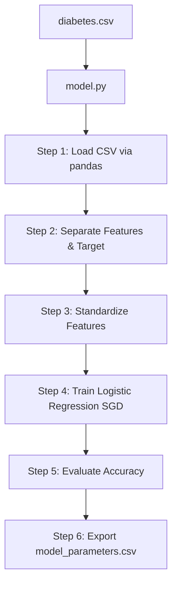

### 2. Application Startup & Database Initialization

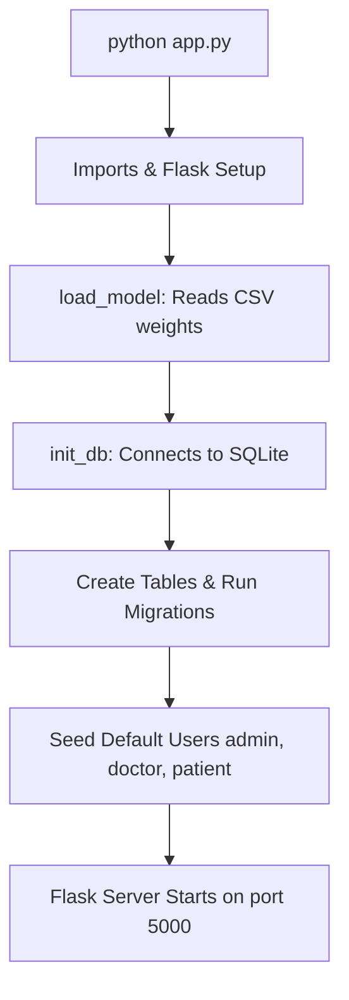

### 3. Complete Request Lifecycle — Landing Page

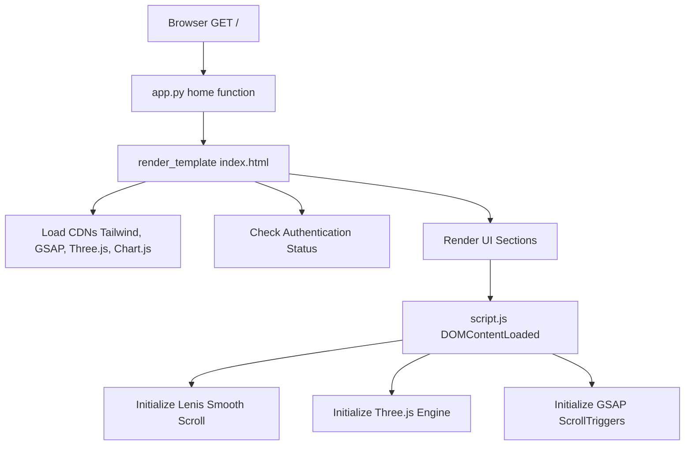

### 3.5 Cinematic UI & Animation Architecture (Three.js & GSAP)

DiabPredict AI features an award-winning cinematic UI built to run at 60 FPS using GPU acceleration.

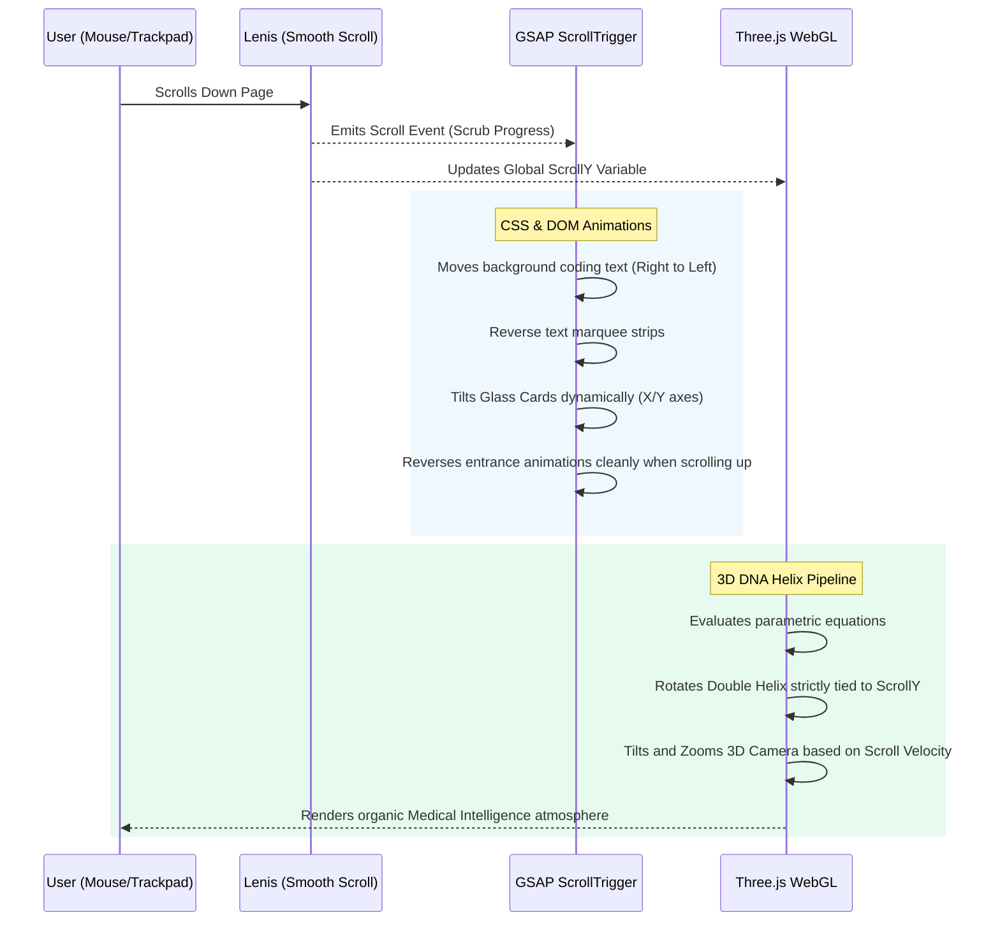

### 4. Complete Prediction Flow — User Submits Biometric Form

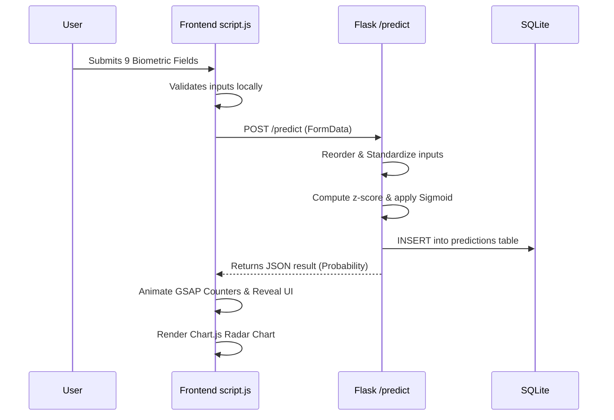

### 5. Full Report Page Flow

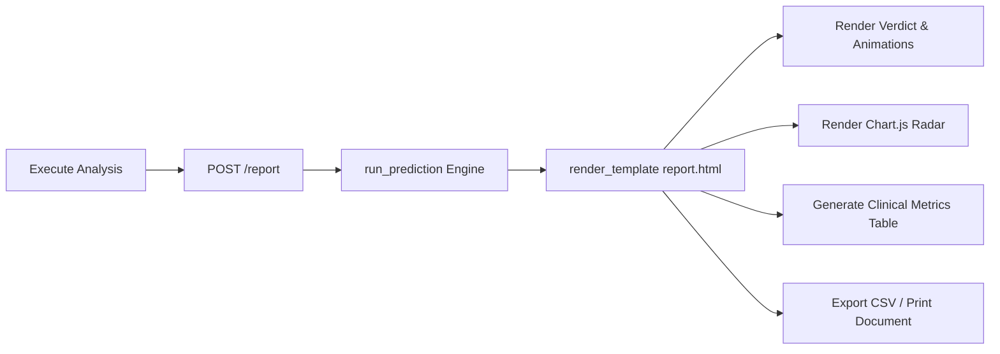

### 6. Authentication & Session Flow

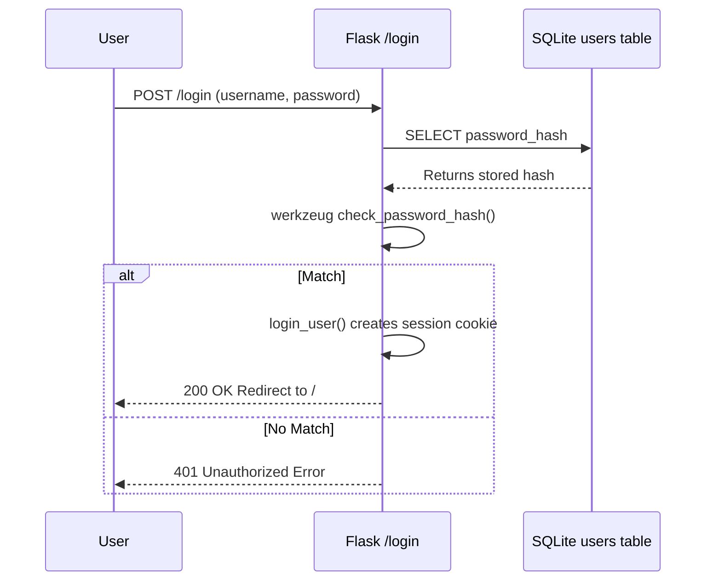

### 7. User Registration Flow

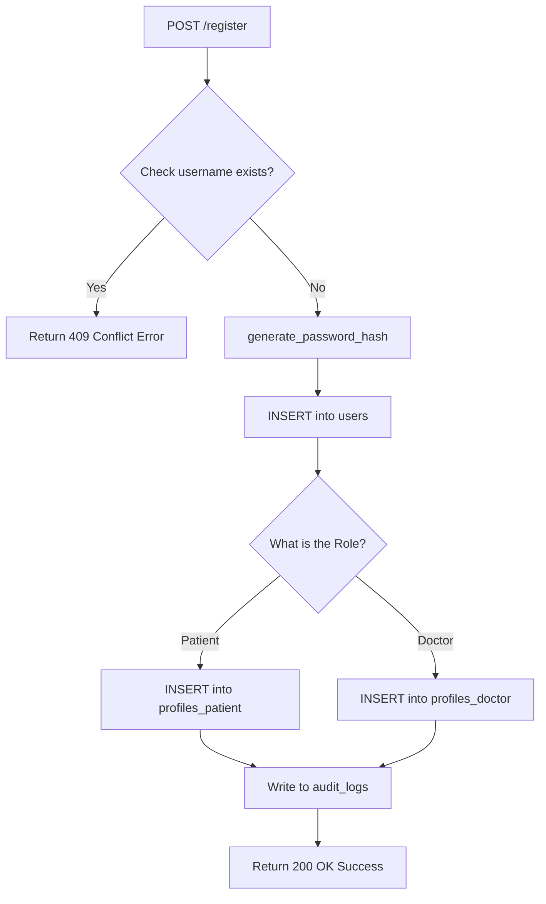

### 8. EMR Portal — Doctor Workflow

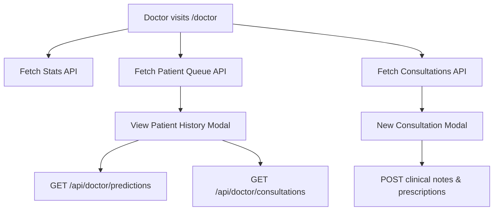

### 9. Admin Dashboard — System Management

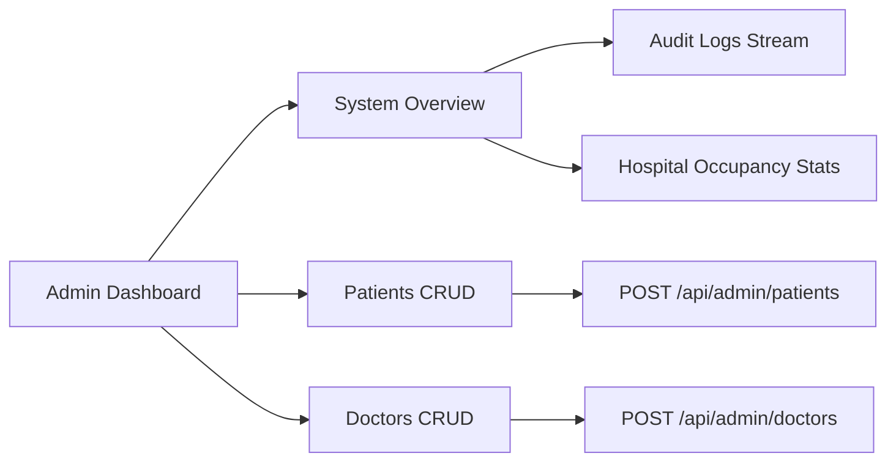

### 10. Analysis Dashboard — Prediction History

```mermaid
flowchart TD
    A[User visits /analysis] --> B[GET /api/history]
    B --> C[Populate Sidebar List]
    C --> D[Select Specific Prediction]
    D --> E[Render Donut Chart (Risk %)]
    D --> F[Render Bar Chart (Metrics)]
    D --> G[Reopen in Predictor (URL Hash)]
    D --> H[Delete API Request]
```

### 11. AI Health Assistant Flow

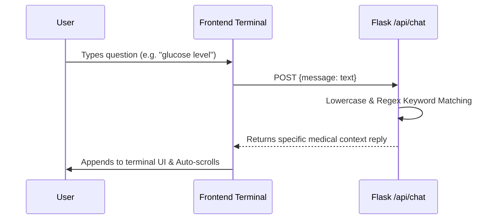

### 12. Database Schema & Relationships (ERD)

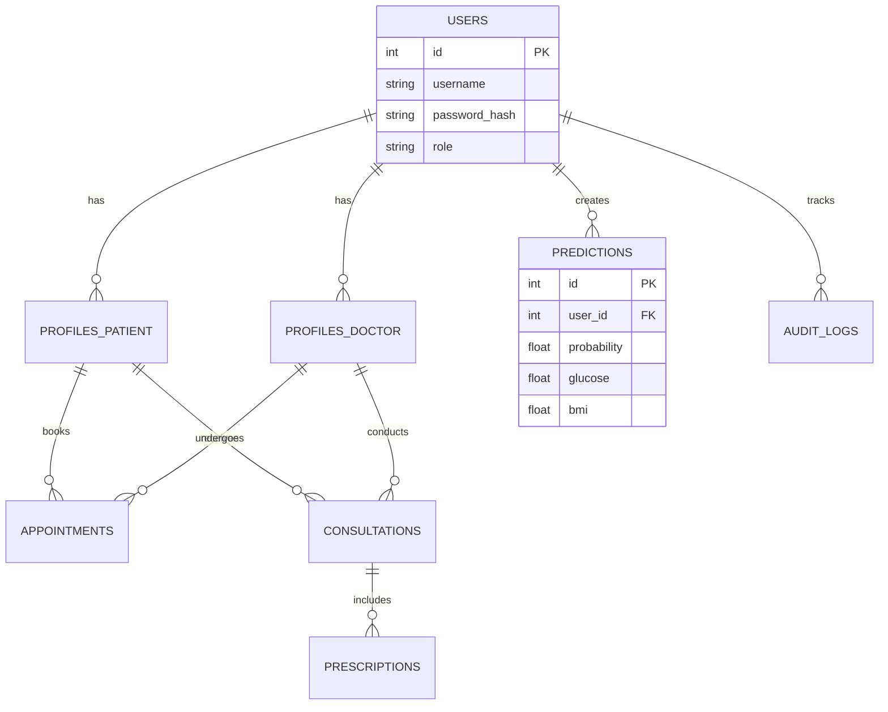
